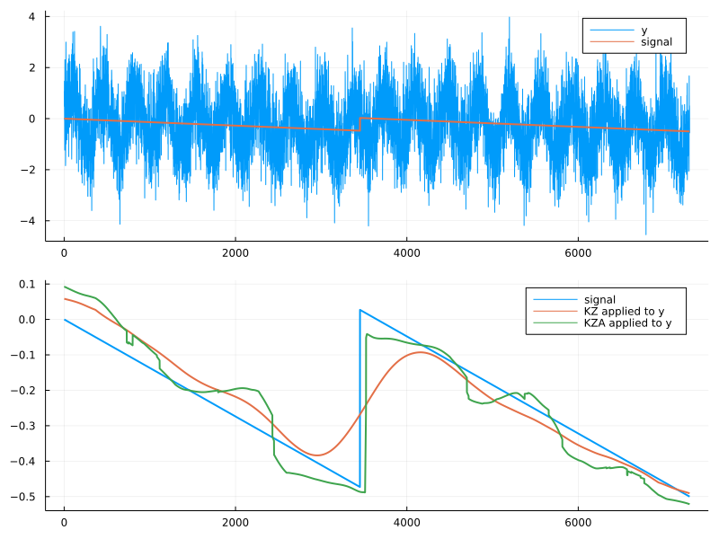

# KolmogorovZurbenkoFilters

[](https://github.com/leifdenby/KolmogorovZurbenkoFilters.jl/actions/workflows/CI.yml?query=branch%3Amain)

[Kolmogorov-Zurbenko filters](https://en.wikipedia.org/wiki/Kolmogorov–Zurbenko_filter) are an adaption of moving-average filtering which makes for a better low-pass filter. [Zurbenko et al 1996](https://doi.org/10.1175%2F1520-0442%281996%29009%3C3548%3ADDITSO%3E2.0.CO%3B2) extended the technique to locally adapt the window-size so that discontunities in underlying signal can be detected.

According to wikipedia:

> A. N. Kolmogorov had the original idea for the KZ filter during a study of turbulence in the Pacific Ocean.[1] Kolmogorov had just received the International Balzan Prize for his law of 5/3 in the energy spectra of turbulence. Surprisingly the 5/3 law was not obeyed in the Pacific Ocean, causing great concern. Standard fast Fourier transform (FFT) was completely fooled by the noisy and non-stationary ocean environment. KZ filtration resolved the problem and enabled proof of Kolmogorov's law in that domain. 

## Example

```julia
using Plots
using KolmogorovZurbenkoFilters


yrs = 20
t = range(0, yrs, yrs*365)
m = 365
# noise
y_error = rand(Normal(), length(t))
y_trend = range(0,-1,length(t))
# signal
bkpt = 3452
y_brk = [repeat([0.0], bkpt); repeat([0.5], length(t)-bkpt)]
y_signal = y_trend + y_brk
# y = seasonal + trend + break point + noise
y = sin.(2*pi*t) + y_signal + y_error

# kz reconstruction of signal
y_kz = kz(y,m)

# kza reconstruction of the signal
y_kza = kza(y,m,minimum_window_length=10, iterations=3)

plot(y, label="y", size=(1000, 400))
plot!(y_signal, label="signal", linewidth=2)
plot!(y_kz, label="KZ applied to y", linewidth=2)
plot!(y_kza, label="KZA applied to y", linewidth=2)
savefig("examples/1d.png")
```



## TODO

- [x] implement `kz` and `kza` in 1D
- [ ] implement `kz` and `kza` in 2D
- [ ] implement `kz` and `kza` in 3D
- [ ] implement periodogram
- [ ] implement Kolmogorov-Zurbenko Fourier Transform

## Sources

- 
